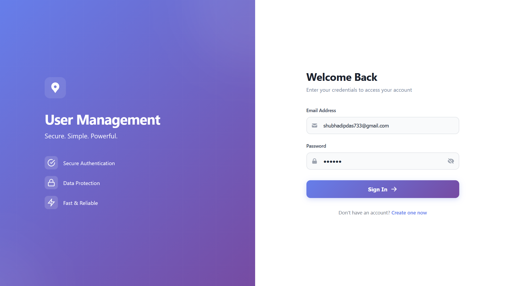
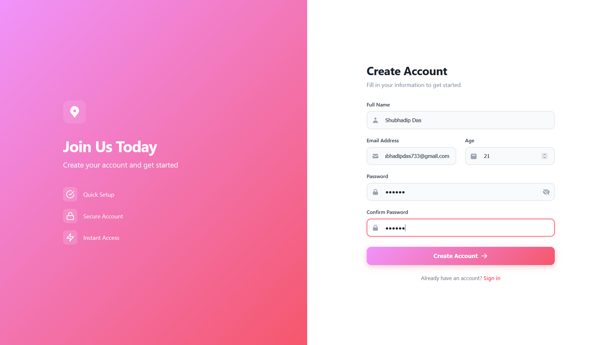
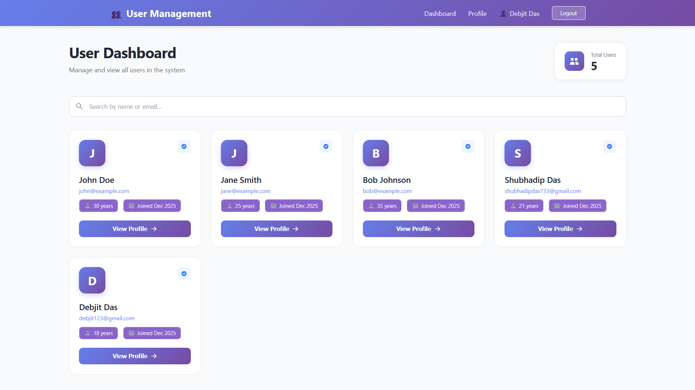
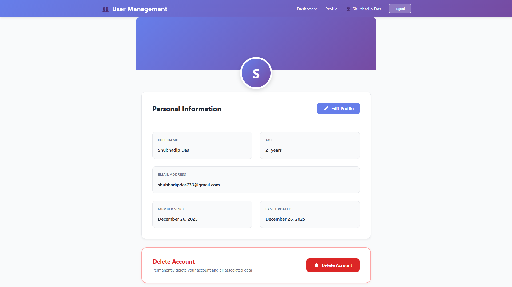
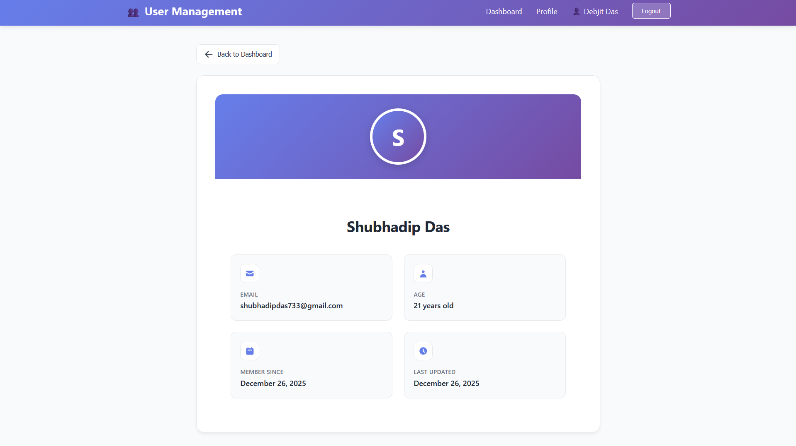

# 🚀 Full-Stack User Management System

A modern, production-ready user management system built with React, Node.js, Express, and PostgreSQL. Features a beautiful UI/UX, JWT authentication, and complete CRUD operations.


## 📋 Table of Contents

- [Features](#-features)
- [Tech Stack](#-tech-stack)
- [Architecture](#-architecture)
- [Prerequisites](#-prerequisites)
- [Installation](#-installation)
- [Configuration](#-configuration)
- [Running the Application](#-running-the-application)
- [API Documentation](#-api-documentation)
- [Project Structure](#-project-structure)
- [Database Schema](#-database-schema)
- [Screenshots](#-screenshots)
- [Testing](#-testing)
- [Deployment](#-deployment)
- [Contributing](#-contributing)
- [License](#-license)

## ✨ Features

### Core Functionality
- ✅ **User Authentication** - JWT-based secure authentication
- ✅ **User Registration** - Create new accounts with validation
- ✅ **User Login** - Secure login with token-based sessions
- ✅ **Profile Management** - View and edit user profiles
- ✅ **Password Management** - Change passwords securely
- ✅ **Account Deletion** - Delete accounts with password confirmation
- ✅ **User Dashboard** - View all users with search functionality
- ✅ **User Profiles** - View detailed information about other users

### UI/UX Features
- 🎨 **Modern Design** - Beautiful gradient-based design system
- 📱 **Fully Responsive** - Works seamlessly on all devices
- ⚡ **Fast & Smooth** - Optimized performance with smooth animations
- 🔒 **Secure** - Protected routes and secure authentication
- 💅 **Professional UI** - Production-ready interface with attention to detail
- 🎯 **User-Friendly** - Intuitive navigation and clear feedback
- 🌈 **Consistent Theme** - Purple gradient theme throughout the app

### Technical Features
- 🔐 **JWT Authentication** - Secure token-based authentication
- 🗄️ **PostgreSQL Database** - Robust relational database
- 🛡️ **Input Validation** - Server and client-side validation
- 🚨 **Error Handling** - Comprehensive error handling with user feedback
- 📊 **RESTful API** - Clean and well-documented API endpoints
- 🔄 **State Management** - Efficient React state management
- 🎭 **Loading States** - Beautiful loading indicators
- ✅ **Success Messages** - Clear success/error notifications

## 🛠 Tech Stack

### Frontend
- **React 18.2.0** - UI library
- **React Router DOM 6.x** - Client-side routing
- **Axios** - HTTP client for API calls
- **CSS3** - Modern styling with flexbox and grid

### Backend
- **Node.js 16+** - JavaScript runtime
- **Express 4.x** - Web application framework
- **PostgreSQL 14+** - Relational database
- **JWT** - JSON Web Tokens for authentication
- **bcrypt** - Password hashing
- **CORS** - Cross-origin resource sharing
- **dotenv** - Environment variable management

### Development Tools
- **Postman** - API testing
- **pgAdmin 4** - Database management
- **VS Code** - Code editor
- **Git** - Version control

## 🏗 Architecture

```
┌─────────────────────────────────────────────────────────┐
│                    Frontend (React)                     │
│  ┌─────────────┐  ┌─────────────┐  ┌─────────────┐      │
│  │   Login     │  │  Dashboard  │  │   Profile   │      │
│  └─────────────┘  └─────────────┘  └─────────────┘      │
│           │                │                │           │
│           └────────────────┴────────────────┘           │
│                         │                               │
│                    Axios API Client                     │
└─────────────────────────┬───────────────────────────────┘
                          │
                    REST API (HTTP/HTTPS)
                          │
┌─────────────────────────┴───────────────────────────────┐
│                Backend (Express/Node.js)                │
│  ┌─────────────┐  ┌─────────────┐  ┌─────────────┐      │
│  │    Auth     │  │    Users    │  │   Routes    │      │
│  │ Middleware  │  │  Controller │  │   Handler   │      │
│  └─────────────┘  └─────────────┘  └─────────────┘      │
│                         │                               │
│                    Database Layer                       │
└─────────────────────────┬───────────────────────────────┘
                          │
┌─────────────────────────┴───────────────────────────────┐
│              PostgreSQL Database                        │
│  ┌─────────────────────────────────────────────┐        │
│  │         users                               │        │
│  │  • id (PK)                                  │        │
│  │  • name                                     │        │
│  │  • email (UNIQUE)                           │        │
│  │  • password (HASHED)                        │        │
│  │  • age                                      │        │ 
│  │  • created_at                               │        │
│  │  • updated_at                               │        │
│  └─────────────────────────────────────────────┘        │
└─────────────────────────────────────────────────────────┘
```

## 📦 Prerequisites

Before you begin, ensure you have the following installed:

- **Node.js** (v16.0.0 or higher) - [Download](https://nodejs.org/)
- **PostgreSQL** (v14 or higher) - [Download](https://www.postgresql.org/download/)
- **npm** or **yarn** - Comes with Node.js
- **Git** - [Download](https://git-scm.com/)
- **pgAdmin 4** (Optional) - Database management tool

## 🚀 Installation

### 1. Clone the Repository

```bash
git clone https://github.com/Shubhadip2005/user-management-system.git
cd user-management-system
```

### 2. Backend Setup

```bash
# Navigate to backend directory
cd backend

# Install dependencies
npm install

# Create .env file
cp .env.example .env
```

**Edit `.env` file with your configuration:**

```env
# Server Configuration
PORT=5000
NODE_ENV=development

# Database Configuration
DB_HOST=localhost
DB_PORT=5432
DB_NAME=user_management
DB_USER=postgres
DB_PASSWORD=your_password

# JWT Configuration
JWT_SECRET=your_super_secret_jwt_key_change_this_in_production
JWT_EXPIRE=24h

# CORS Configuration
FRONTEND_URL=http://localhost:3000
```

### 3. Database Setup

**Option A: Using pgAdmin 4**

1. Open pgAdmin 4
2. Right-click on "Databases" → Create → Database
3. Name: `user_management`
4. Click "Save"
5. Open Query Tool (Right-click on database → Query Tool)
6. Run the following SQL:

```sql
CREATE TABLE users (
  id SERIAL PRIMARY KEY,
  name VARCHAR(100) NOT NULL,
  email VARCHAR(100) UNIQUE NOT NULL,
  password VARCHAR(255) NOT NULL,
  age INTEGER NOT NULL,
  created_at TIMESTAMP DEFAULT CURRENT_TIMESTAMP,
  updated_at TIMESTAMP DEFAULT CURRENT_TIMESTAMP
);

-- Create index for faster email lookups
CREATE INDEX idx_users_email ON users(email);

-- Create trigger to update updated_at timestamp
CREATE OR REPLACE FUNCTION update_updated_at_column()
RETURNS TRIGGER AS $$
BEGIN
   NEW.updated_at = CURRENT_TIMESTAMP;
   RETURN NEW;
END;
$$ language 'plpgsql';

CREATE TRIGGER update_users_updated_at BEFORE UPDATE
ON users FOR EACH ROW
EXECUTE FUNCTION update_updated_at_column();
```

**Option B: Using Command Line**

```bash
# Connect to PostgreSQL
psql -U postgres

# Create database
CREATE DATABASE user_management;

# Connect to the database
\c user_management

# Run the SQL commands from Option A above

# Exit psql
\q
```

### 4. Frontend Setup

```bash
# Navigate to frontend directory (from project root)
cd ../frontend

# Install dependencies
npm install
```

## ⚙️ Configuration

### Backend Configuration

**File: `backend/.env`**

| Variable | Description | Example |
|----------|-------------|---------|
| `PORT` | Backend server port | `5000` |
| `DB_HOST` | PostgreSQL host | `localhost` |
| `DB_PORT` | PostgreSQL port | `5432` |
| `DB_NAME` | Database name | `user_management` |
| `DB_USER` | Database username | `postgres` |
| `DB_PASSWORD` | Database password | `your_password` |
| `JWT_SECRET` | Secret key for JWT | `change_this_in_production` |
| `JWT_EXPIRE` | JWT expiration time | `24h` |
| `FRONTEND_URL` | Frontend URL for CORS | `http://localhost:3000` |

### Frontend Configuration

**File: `frontend/src/api/api.js`**

```javascript
const API_URL = 'http://localhost:5000/api';
```

Update this URL if your backend is running on a different port or domain.

## 🎮 Running the Application

### Development Mode

**Terminal 1 - Backend:**

```bash
cd backend
npm start

# Output:
# Server running on port 5000
# Database connected successfully
```

**Terminal 2 - Frontend:**

```bash
cd frontend
npm start

# Output:
# Compiled successfully!
# Local: http://localhost:3000
```

### Production Mode

**Backend:**

```bash
cd backend
npm run start:prod
```

**Frontend:**

```bash
cd frontend
npm run build
npm install -g serve
serve -s build -p 3000
```

## 📚 API Documentation

### Base URL

```
http://localhost:5000/api
```

### Authentication

All protected routes require a JWT token in the Authorization header:

```
Authorization: Bearer <token>
```

### Endpoints

#### 1. Register User

**POST** `/auth/register`

**Request Body:**
```json
{
  "name": "John Doe",
  "email": "john@example.com",
  "password": "password123",
  "age": 25
}
```

**Response (201):**
```json
{
  "success": true,
  "message": "User registered successfully",
  "data": {
    "token": "eyJhbGciOiJIUzI1NiIsInR5cCI6IkpXVCJ9...",
    "user": {
      "id": 1,
      "name": "John Doe",
      "email": "john@example.com",
      "age": 25,
      "created_at": "2025-12-25T10:00:00.000Z",
      "updated_at": "2025-12-25T10:00:00.000Z"
    }
  }
}
```

#### 2. Login

**POST** `/auth/login`

**Request Body:**
```json
{
  "email": "john@example.com",
  "password": "password123"
}
```

**Response (200):**
```json
{
  "success": true,
  "message": "Login successful",
  "data": {
    "token": "eyJhbGciOiJIUzI1NiIsInR5cCI6IkpXVCJ9...",
    "user": {
      "id": 1,
      "name": "John Doe",
      "email": "john@example.com",
      "age": 25,
      "created_at": "2025-12-25T10:00:00.000Z",
      "updated_at": "2025-12-25T10:00:00.000Z"
    }
  }
}
```

#### 3. Get All Users

**GET** `/users` 🔒 *Protected*

**Headers:**
```
Authorization: Bearer <token>
```

**Response (200):**
```json
{
  "success": true,
  "count": 2,
  "data": [
    {
      "id": 1,
      "name": "John Doe",
      "email": "john@example.com",
      "age": 25,
      "created_at": "2025-12-25T10:00:00.000Z",
      "updated_at": "2025-12-25T10:00:00.000Z"
    },
    {
      "id": 2,
      "name": "Jane Smith",
      "email": "jane@example.com",
      "age": 30,
      "created_at": "2025-12-25T11:00:00.000Z",
      "updated_at": "2025-12-25T11:00:00.000Z"
    }
  ]
}
```

#### 4. Get User by ID

**GET** `/users/:id` 🔒 *Protected*

**Response (200):**
```json
{
  "success": true,
  "data": {
    "id": 1,
    "name": "John Doe",
    "email": "john@example.com",
    "age": 25,
    "created_at": "2025-12-25T10:00:00.000Z",
    "updated_at": "2025-12-25T10:00:00.000Z"
  }
}
```

#### 5. Update User

**PUT** `/users/:id` 🔒 *Protected*

**Request Body:**
```json
{
  "name": "John Updated",
  "email": "johnupdated@example.com",
  "age": 26
}
```

**Response (200):**
```json
{
  "success": true,
  "message": "User updated successfully",
  "data": {
    "id": 1,
    "name": "John Updated",
    "email": "johnupdated@example.com",
    "age": 26,
    "created_at": "2025-12-25T10:00:00.000Z",
    "updated_at": "2025-12-25T12:00:00.000Z"
  }
}
```

#### 6. Change Password

**PUT** `/users/:id/password` 🔒 *Protected*

**Request Body:**
```json
{
  "currentPassword": "password123",
  "newPassword": "newpassword456"
}
```

**Response (200):**
```json
{
  "success": true,
  "message": "Password updated successfully"
}
```

#### 7. Delete User

**DELETE** `/users/:id` 🔒 *Protected*

**Request Body:**
```json
{
  "password": "password123"
}
```

**Response (200):**
```json
{
  "success": true,
  "message": "User deleted successfully"
}
```

### Error Responses

**400 Bad Request:**
```json
{
  "success": false,
  "message": "Email already exists"
}
```

**401 Unauthorized:**
```json
{
  "success": false,
  "message": "Invalid credentials"
}
```

**403 Forbidden:**
```json
{
  "success": false,
  "message": "Not authorized to access this resource"
}
```

**404 Not Found:**
```json
{
  "success": false,
  "message": "User not found"
}
```

**500 Internal Server Error:**
```json
{
  "success": false,
  "message": "Server error occurred"
}
```

## 📁 Project Structure

```
user-management-system/
│
├── backend/                      # Backend Node.js application
│   ├── config/                   # Configuration files
│   │   └── db.js                # Database connection
│   │
│   ├── controllers/              # Route controllers
│   │   ├── authController.js    # Authentication logic
│   │   └── userController.js    # User CRUD logic
│   │
│   ├── middleware/               # Custom middleware
│   │   └── auth.js              # JWT authentication middleware
│   │
│   ├── routes/                   # API routes
│   │   ├── auth.js              # Authentication routes
│   │   └── users.js             # User routes
│   │
│   ├── .env                      # Environment variables
│   ├── .env.example              # Environment template
│   ├── server.js                 # Entry point
│   └── package.json              # Backend dependencies
│
└── frontend/                     # Frontend React application
    ├── public/                   # Public assets
    │   ├── index.html           # HTML template
    │   └── favicon.ico          # Favicon
    │
    ├── src/                      # Source files
    │   ├── api/                  # API integration
    │   │   └── api.js           # Axios configuration
    │   │
    │   ├── components/           # React components
    │   │   ├── Auth/            # Authentication components
    │   │   │   ├── Login.js
    │   │   │   ├── Login.css
    │   │   │   ├── Register.js
    │   │   │   └── Register.css
    │   │   │
    │   │   ├── Dashboard/       # Dashboard components
    │   │   │   ├── Dashboard.js
    │   │   │   └── Dashboard.css
    │   │   │
    │   │   ├── Profile/         # Profile components
    │   │   │   ├── Profile.js
    │   │   │   └── Profile.css
    │   │   │
    │   │   ├── UserProfile/     # User profile view
    │   │   │   ├── UserProfile.js
    │   │   │   └── UserProfile.css
    │   │   │
    │   │   └── Navbar/          # Navigation bar
    │   │       ├── Navbar.js
    │   │       └── Navbar.css
    │   │
    │   ├── App.js                # Main App component
    │   ├── App.css               # Global styles
    │   ├── index.js              # Entry point
    │   └── index.css             # Base styles
    │
    └── package.json              # Frontend dependencies
```

## 🗄 Database Schema

### Users Table

| Column | Type | Constraints | Description |
|--------|------|-------------|-------------|
| `id` | SERIAL | PRIMARY KEY | Unique user identifier |
| `name` | VARCHAR(100) | NOT NULL | User's full name |
| `email` | VARCHAR(100) | UNIQUE, NOT NULL | User's email address |
| `password` | VARCHAR(255) | NOT NULL | Hashed password |
| `age` | INTEGER | NOT NULL | User's age |
| `created_at` | TIMESTAMP | DEFAULT NOW() | Account creation timestamp |
| `updated_at` | TIMESTAMP | DEFAULT NOW() | Last update timestamp |

**Indexes:**
- Primary key index on `id`
- Unique index on `email`
- Index on `email` for faster lookups

**Triggers:**
- `update_users_updated_at` - Automatically updates `updated_at` on row update

## 📸 Screenshots

### Login Page

*Beautiful split-screen login with gradient background*

### Register Page

*User-friendly registration form with validation*

### Dashboard

*Modern dashboard with user cards and search functionality*

### Profile Page

*Comprehensive profile management with edit capabilities*

### User Profile View

*Clean user profile view with detailed information*

## 🧪 Testing

### Backend Testing with Postman

1. **Import Collection**
   - Download `postman_collection.json`
   - Import into Postman

2. **Set Environment Variables**
   - `base_url`: `http://localhost:5000`
   - `token`: (will be set after login)

3. **Test Sequence**
   ```
   1. POST /api/auth/register
   2. POST /api/auth/login (save token)
   3. GET /api/users (use token)
   4. GET /api/users/:id (use token)
   5. PUT /api/users/:id (use token)
   6. PUT /api/users/:id/password (use token)
   7. DELETE /api/users/:id (use token)
   ```

### Frontend Testing

**Manual Testing Checklist:**

- [ ] User Registration
  - [ ] Valid data submission
  - [ ] Email validation
  - [ ] Password strength validation
  - [ ] Duplicate email handling
  
- [ ] User Login
  - [ ] Valid credentials
  - [ ] Invalid credentials
  - [ ] Token persistence
  - [ ] Auto-redirect after login
  
- [ ] Dashboard
  - [ ] Display all users
  - [ ] Search functionality
  - [ ] User card interactions
  - [ ] View profile navigation
  
- [ ] Profile Management
  - [ ] View own profile
  - [ ] Edit profile information
  - [ ] Change password
  - [ ] Delete account with confirmation
  
- [ ] User Profile View
  - [ ] View other user profiles
  - [ ] Display all user information
  - [ ] Back to dashboard navigation

- [ ] Responsive Design
  - [ ] Desktop view (1920x1080)
  - [ ] Tablet view (768x1024)
  - [ ] Mobile view (375x667)

## 🚢 Deployment

### Backend Deployment (Heroku)

```bash
# Install Heroku CLI
# Login to Heroku
heroku login

# Create app
heroku create your-app-name

# Add PostgreSQL addon
heroku addons:create heroku-postgresql:hobby-dev

# Set environment variables
heroku config:set JWT_SECRET=your_secret_key
heroku config:set NODE_ENV=production

# Deploy
git push heroku main

# Run migrations
heroku pg:psql < database/schema.sql
```

### Frontend Deployment (Vercel)

```bash
# Install Vercel CLI
npm install -g vercel

# Login to Vercel
vercel login

# Deploy
cd frontend
vercel

# Set environment variable for API URL
# In Vercel dashboard: Settings → Environment Variables
# Add: REACT_APP_API_URL = https://your-backend.herokuapp.com/api
```

### Environment Variables for Production

**Backend (.env):**
```env
NODE_ENV=production
PORT=5000
DB_HOST=your-production-db-host
DB_PORT=5432
DB_NAME=your_production_db
DB_USER=your_db_user
DB_PASSWORD=your_secure_password
JWT_SECRET=your_very_secure_jwt_secret_key
JWT_EXPIRE=24h
FRONTEND_URL=https://your-frontend-domain.com
```

**Frontend (.env):**
```env
REACT_APP_API_URL=https://your-backend-domain.com/api
```

## 🤝 Contributing

Contributions are welcome! Please follow these steps:

1. **Fork the repository**
2. **Create a feature branch**
   ```bash
   git checkout -b feature/amazing-feature
   ```
3. **Commit your changes**
   ```bash
   git commit -m 'Add some amazing feature'
   ```
4. **Push to the branch**
   ```bash
   git push origin feature/amazing-feature
   ```
5. **Open a Pull Request**

### Coding Standards

- Follow ESLint rules
- Write meaningful commit messages
- Add comments for complex logic
- Update documentation for new features
- Test before submitting PR

## 📝 License

This project is licensed under the MIT License - see the [LICENSE](LICENSE) file for details.

## 👥 Authors

- **Your Name** - *Initial work* - [Shubhadip2005](https://github.com/Shubhadip2005)

## 🙏 Acknowledgments

- React documentation
- Express.js community
- PostgreSQL documentation
- All contributors who helped improve this project

## 📧 Contact

- **Email**: shubhadipdas733@gmail.com
- **LinkedIn**: [Shubhadip Das](https://linkedin.com/in/shubhadip-das-6040052a7)
- **GitHub**: [Shubhadip2005](https://github.com/Shubhadip2005)

## 🔮 Future Enhancements

- [ ] Email verification
- [ ] Password reset functionality
- [ ] Profile picture upload
- [ ] User roles and permissions
- [ ] Activity logs
- [ ] Social media authentication
- [ ] Two-factor authentication
- [ ] Advanced search filters
- [ ] Export user data
- [ ] Dark mode toggle
- [ ] Internationalization (i18n)
- [ ] Real-time notifications
- [ ] User analytics dashboard

## 📊 Project Status

**Current Version:** 3.0.0  
**Status:** ✅ Production Ready  
**Last Updated:** December 25, 2025

---

<div align="center">

**⭐ Star this repository if you found it helpful!**

Made with ❤️ by [Shubhadip Das](https://github.com/Shubhadip2005)

</div>